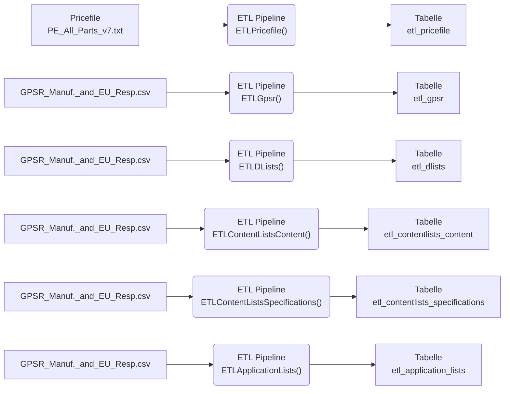

# Datenfluss

```mermaid

flowchart LR
    E1[Pricefile<br>PE_All_Parts_v7.txt]
    ETL1("ETL Pipeline<br>ETLPricefile()") 
    A1[Tabelle<br>etl_pricefile]
    E1 --> ETL1 --> A1
    
    E2[GPSR_Manuf._and_EU_Resp.csv]
    ETL2("ETL Pipeline<br>ETLGpsr()") 
    A2[Tabelle<br>etl_gpsr]
    E2 --> ETL2 --> A2
    
    E3[GPSR_Manuf._and_EU_Resp.csv]
    ETL3("ETL Pipeline<br>ETLDLists()") 
    A3[Tabelle<br>etl_dlists]
    E3 --> ETL3 --> A3
    
    E4[GPSR_Manuf._and_EU_Resp.csv]
    ETL4("ETL Pipeline<br>ETLContentListsContent()") 
    A4[Tabelle<br>etl_contentlists_content]
    E4 --> ETL4 --> A4
    
    E5[GPSR_Manuf._and_EU_Resp.csv]
    ETL5("ETL Pipeline<br>ETLContentListsSpecifications()") 
    A5[Tabelle<br>etl_contentlists_specifications]
    E5 --> ETL5 --> A5
    
    E6[GPSR_Manuf._and_EU_Resp.csv]
    ETL6("ETL Pipeline<br>ETLApplicationLists()") 
    A6[Tabelle<br>etl_application_lists]
    E6 --> ETL6  --> A6
    
    
    
    
```
