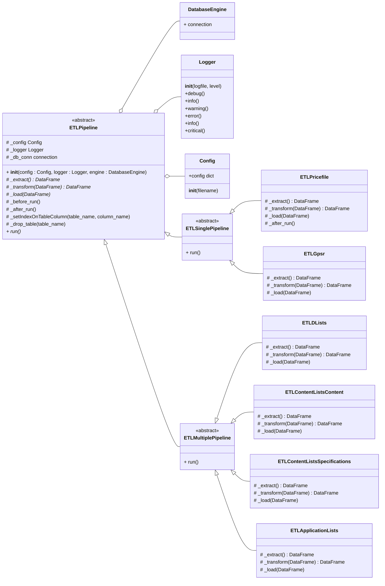

#  UML Klassendiagramm

```mermaid
classDiagram   
direction LR

class DatabaseEngine { 
    + connection
}
class Logger { 
    __init__(logfile, level)
    +debug()
    +info()
    +warning()
    +error()
    +info()
    +critical()
}
class Config { 
    __init__(filename)
    +config dict
}


class ETLPipeline {
    <<abstract>>
    # _config Config
    # _logger Logger
    # _db_conn connection
    
    + __init__(config : Config, logger : Logger, engine : DatabaseEngine)
    
    # _extract()* DataFrame 
    # _transform(DataFrame)* DataFrame
    # _load(DataFrame)*
    
    # _before_run()
    # _after_run()
    
    # _setIndexOnTableColumn(table_name, column_name)
    # _drop_table(table_name)
    + run()*
}

class ETLSinglePipeline { 
    <<abstract>>
    + run()
}

class ETLMultiplePipeline { 
    <<abstract>>
    + run()
}

class ETLPricefile {
    # _extract() DataFrame 
    # _transform(DataFrame) DataFrame
    # _load(DataFrame)
    # _after_run()
} 

class ETLGpsr {
    # _extract() DataFrame 
    # _transform(DataFrame) DataFrame
    # _load(DataFrame)
}

class ETLDLists {
    # _extract() DataFrame 
    # _transform(DataFrame) DataFrame
    # _load(DataFrame)
}

class ETLContentListsContent {
    # _extract() DataFrame 
    # _transform(DataFrame) DataFrame
    # _load(DataFrame)
}

class ETLContentListsSpecifications {
    # _extract() DataFrame 
    # _transform(DataFrame) DataFrame
    # _load(DataFrame)
}

class ETLApplicationLists {
    # _extract() DataFrame 
    # _transform(DataFrame) DataFrame
    # _load(DataFrame)
}

ETLPipeline o-- DatabaseEngine
ETLPipeline o-- Logger
ETLPipeline o-- Config

ETLPipeline <|-- ETLSinglePipeline
ETLPipeline <|-- ETLMultiplePipeline

ETLSinglePipeline <|-- ETLPricefile
ETLSinglePipeline <|-- ETLGpsr

ETLMultiplePipeline  <|-- ETLDLists
ETLMultiplePipeline  <|-- ETLContentListsContent
ETLMultiplePipeline  <|-- ETLContentListsSpecifications
ETLMultiplePipeline  <|-- ETLApplicationLists
 
```

