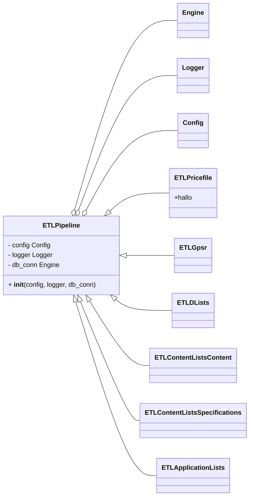

#  UML Klassendiagramm

```mermaid
classDiagram   
direction LR

class Engine { }
class Logger { }
class Config { }


class ETLPipeline {
    - config Config
    - logger Logger
    - db_conn Engine
    
    + __init__(config, logger, db_conn)
}

class ETLPricefile {
    +hallo
}

ETLPipeline o-- Engine
ETLPipeline o-- Logger
ETLPipeline o-- Config

ETLPipeline <|-- ETLPricefile
ETLPipeline <|-- ETLGpsr
ETLPipeline <|-- ETLDLists
ETLPipeline <|-- ETLContentListsContent
ETLPipeline <|-- ETLContentListsSpecifications
ETLPipeline <|-- ETLApplicationLists

```

