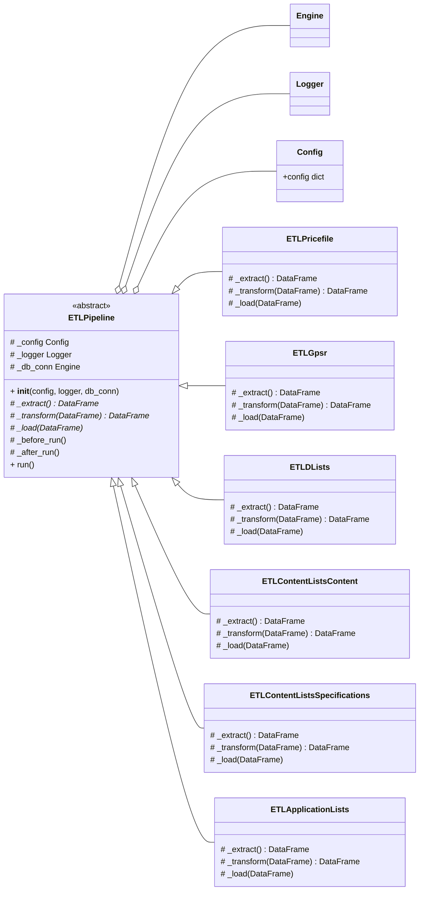

#  UML Klassendiagramm

```mermaid
classDiagram   
direction LR

class Engine { }
class Logger { }
class Config { 
    +config dict
}


class ETLPipeline {
    <<abstract>>
    # _config Config
    # _logger Logger
    # _db_conn Engine
    
    + __init__(config, logger, db_conn)
    
    # _extract()* DataFrame 
    # _transform(DataFrame)* DataFrame
    # _load(DataFrame)*
    
    # _before_run()
    # _after_run()
    
    + run()
}

class ETLPricefile {
    # _extract() DataFrame 
    # _transform(DataFrame) DataFrame
    # _load(DataFrame)
}

class ETLGpsr {
    # _extract() DataFrame 
    # _transform(DataFrame) DataFrame
    # _load(DataFrame)
}

class ETLDLists {
    # _extract() DataFrame 
    # _transform(DataFrame) DataFrame
    # _load(DataFrame)
}

class ETLContentListsContent {
    # _extract() DataFrame 
    # _transform(DataFrame) DataFrame
    # _load(DataFrame)
}

class ETLContentListsSpecifications {
    # _extract() DataFrame 
    # _transform(DataFrame) DataFrame
    # _load(DataFrame)
}

class ETLApplicationLists {
    # _extract() DataFrame 
    # _transform(DataFrame) DataFrame
    # _load(DataFrame)
}

ETLPipeline o-- Engine
ETLPipeline o-- Logger
ETLPipeline o-- Config

ETLPipeline <|-- ETLPricefile
ETLPipeline <|-- ETLGpsr
ETLPipeline <|-- ETLDLists
ETLPipeline <|-- ETLContentListsContent
ETLPipeline <|-- ETLContentListsSpecifications
ETLPipeline <|-- ETLApplicationLists

```

